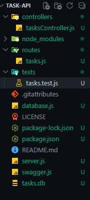
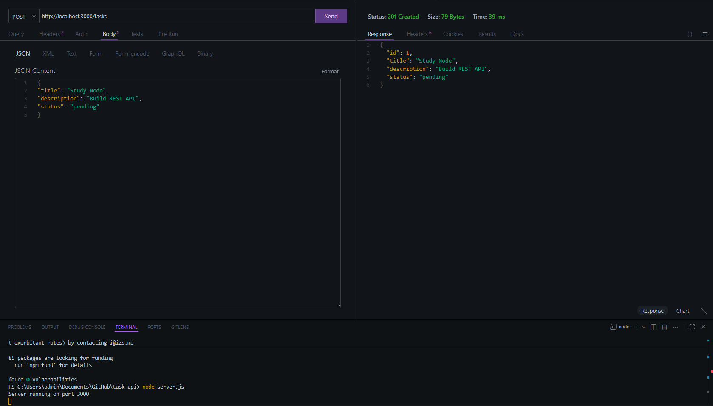
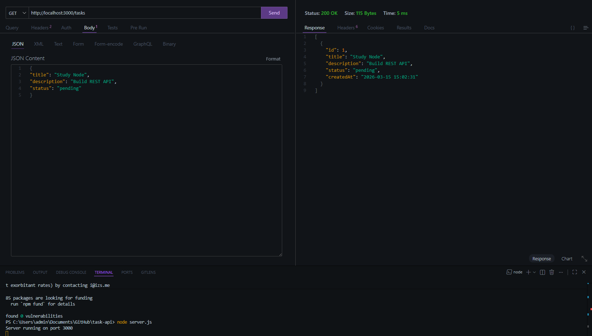
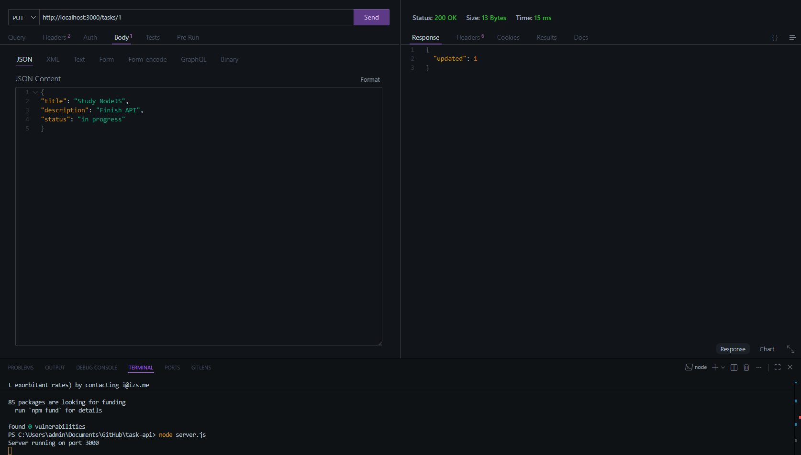
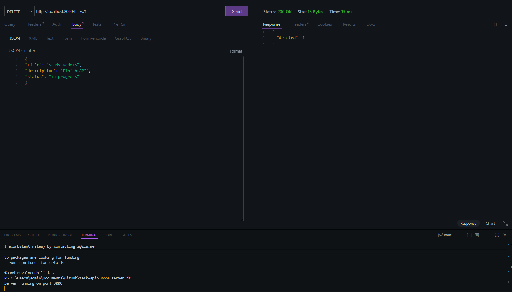

# Task API

RESTful API for task management built with **Node.js**, **Express**, and **SQLite**.
This project allows users to create, read, update, and delete tasks while persisting data in a database.

The API follows **REST principles**, includes **data validation**, **automated tests**, and **Swagger documentation** for easy interaction with the endpoints.

This project was developed as part of a backend challenge.

---

## Features

* Create tasks
* List all tasks
* Update tasks
* Delete tasks
* Data validation
* SQLite database persistence
* API documentation with Swagger
* Basic automated tests

---

## Technologies Used

* Node.js
* Express.js
* SQLite
* Swagger UI
* Jest (for testing)

---


## Project Structure

```
task-api
│
├── controllers        # Business logic for tasks
├── routes             # API routes
├── tests              # Automated tests
├── images             # Images used in documentation
│
├── database.js        # SQLite database connection
├── server.js          # Main server configuration
├── swagger.js         # Swagger API documentation setup
│
├── tasks.db           # SQLite database file
├── package.json       # Project dependencies
├── README.md          # Project documentation
├── LICENSE
└── .gitignore
```

## API Demonstration

### Project Structure



---

### Create Task – POST /tasks

This endpoint creates a new task.



---

### Get Tasks – GET /tasks

Returns the list of all tasks stored in the database.



---

### Update Task – PUT /tasks/:id

Updates an existing task.



---

### Delete Task – DELETE /tasks/:id

Removes a task from the database.




---

## Installation

Clone the repository:

```
git clone https://github.com/your-username/task-api.git
```

Enter the project folder:

```
cd task-api
```

Install dependencies:

```
npm install
```

---

## Running the API

Start the server:

```
npm start
```

or (if using nodemon)

```
npm run dev
```

The API will run on:

```
http://localhost:3000
```

---

## API Endpoints

### Create Task

POST `/tasks`

Request body:

```json
{
  "title": "Study Node.js",
  "description": "Learn how to build REST APIs",
  "status": "pending"
}
```

---

### Get All Tasks

GET `/tasks`

Returns a list of all tasks.

---

### Update Task

PUT `/tasks/:id`

Example:

```json
{
  "title": "Study Express",
  "description": "Practice building APIs",
  "status": "in-progress"
}
```

---

### Delete Task

DELETE `/tasks/:id`

Removes a task from the database.

---

## Task Model

Each task contains:

| Field       | Type    | Description                     |
| ----------- | ------- | ------------------------------- |
| id          | integer | Unique identifier               |
| title       | string  | Task title (required)           |
| description | string  | Task description                |
| status      | string  | pending, in-progress, completed |
| created_at  | date    | Creation timestamp              |

---

## API Documentation

Swagger documentation is available at:

```
http://localhost:3000/api-docs
```

Swagger provides an interactive interface to test all API endpoints.

---

## Running Tests

Run the automated tests with:

```
npm test
```

The tests verify the correct functioning of the API endpoints.

---

## Database

The project uses **SQLite** for simple local persistence.

Database file:

```
tasks.db
```

---

## License

This project is licensed under the MIT License.

---

## Author

Developed by **Vitor Dutra Melo**

Backend Developer | Node.js | REST APIs
